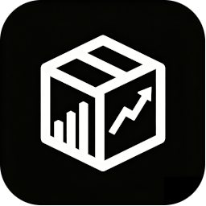
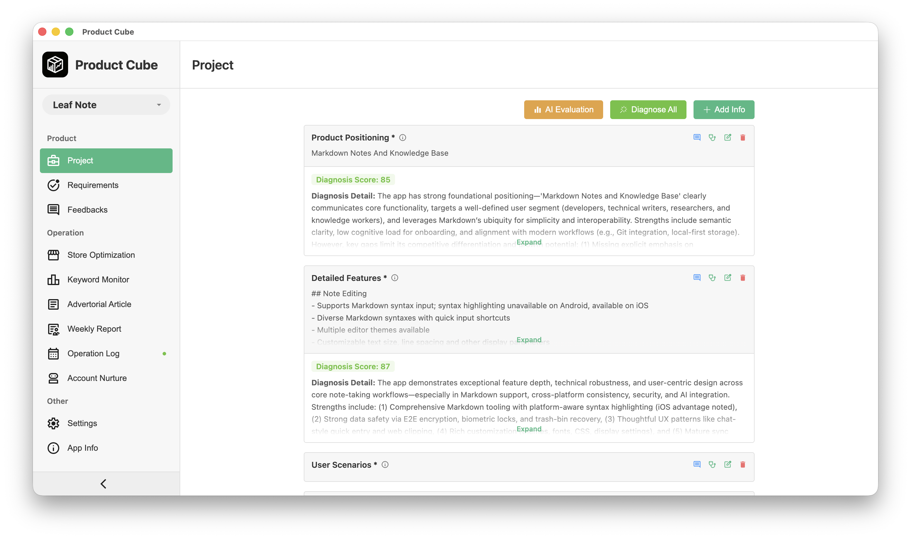
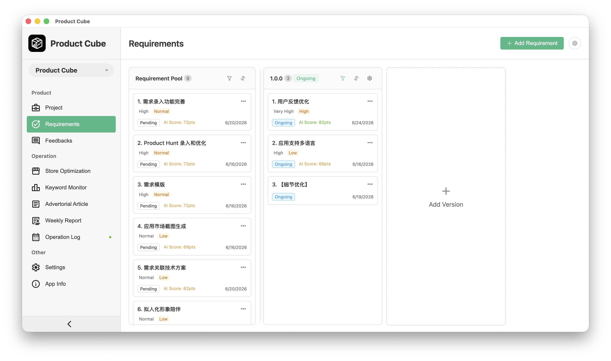
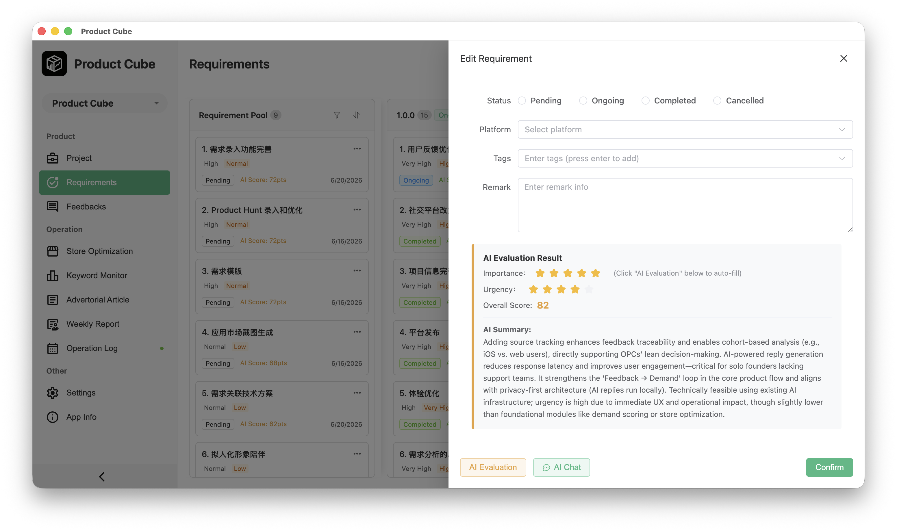
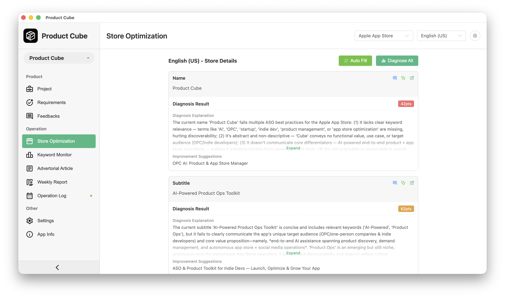
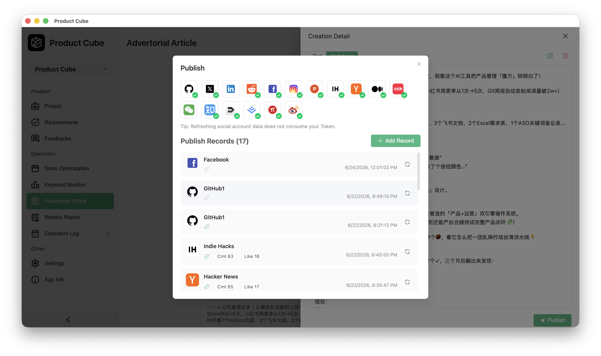
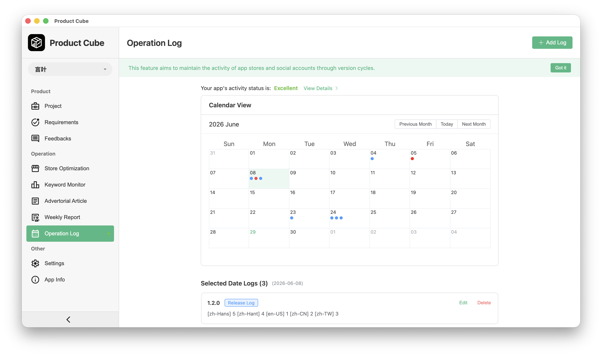

# 🧊 Product Cube

[中文简体](doc/README-zh.md)

**The All-in-One AI Copilot for One-Person Companies & Indie Developers**

> ✅ Fully built.     
> ✅ Production-ready.     
> ✅ No beta — just shipped features.    
> Designed by indie builders, for solo founders: from idea diagnosis → demand-driven development → store-optimized growth — all in one privacy-first desktop app.

*Local-first. Your data never leaves your machine.*

## 🌟 Why Product Cube?

Building alone is hard. Juggling product thinking, user feedback, App Store SEO, social storytelling, and release logistics drains focus — not creativity.

**Product Cube eliminates context-switching.** It’s not another AI chatbot or fragmented SaaS tool. It’s a tightly integrated, offline-capable desktop workspace where **product strategy, demand validation, and growth ops converge** — powered by your own AI models (local or self-hosted), with zero telemetry or cloud lock-in.

Built for the reality of OPCs:

- 🔹 You own your stack.
- 🔹 You ship fast — but never blindly.
- 🔹 You grow authentically, not algorithmically.

## ✅ What’s Included (All Features Are Live)

### 🧩 Product Workflow

*From vague idea to prioritized backlog — grounded in real user needs.*

#### Project Analysis

- Auto-diagnose positioning, core functionality, target scenes, and business model viability
- Holistic project health score + actionable insights
- Context-aware chat: ask “How do I monetize this better?” or “What’s missing vs. competitors?”

#### Demand-Driven Requirements Management

- CRUD for features, epics, and user stories
- Version tracking with AI-generated changelogs & release notes (Git-integrated)
- AI-powered demand scoring: urgency × impact × effort estimation + plain-English rationale

#### Feedback Intelligence

- Submit & triage user feedback (email, in-app, social)
- AI-assisted sentiment + feasibility analysis using your product context
- One-click convert feedback → prioritized requirement
- Template-based, tone-aware reply generation (e.g., “We hear you — here’s why we’re pausing this”)

### 🚀 Operations Workflow

*Turn releases into growth moments — without hiring a marketing team.*

#### App Store Optimization (ASO) Studio

- Manual or browser-scraped import of Google Play / App Store listings
- Instant ASO audit: keyword density, title/description score, icon/screenshot guidance
- AI-generated keyword suggestions + rank tracking (via optional lightweight API proxy)
- Chat over your store metadata: “Rewrite my subtitle for higher CTR”

#### Social-First Content Engine

- One-click soft-launch posts (Twitter/X, LinkedIn, Mastodon, Bluesky) — tailored per platform
- Built-in engagement loop: track link clicks, replies, shares → feed back into feedback & roadmap
- All content generated in-context: references your latest release, user quotes, or GitHub commits

#### Build-in-Public Weekly Reports

- Point to your Git repo → auto-parse commits, PRs, issues
- Generate compelling, human-toned weekly updates for your newsletter or social feed
- Optional: auto-schedule via CLI or export as Markdown/HTML

#### Version & Ops Health Dashboard

- Track release dates across stores, web, and social channels
- Detect silence gaps (“37 days since last post”)
- Visual health score: consistency × reach × resonance

### 🔒 Privacy & Control — Non-Negotiable

- **Your AI, Your Rules**: Bring your own LLM — run Ollama, LM Studio, or connect to local vLLM/Text Generation WebUI
- **Zero Cloud Sync**: All data stored locally (SQLite + encrypted JSON). Export anytime. No vendor lock-in.
- **Offline First**: Analyze feedback, generate changelogs, draft posts — even on a plane.
- **No Tracking**: No analytics, no telemetry, no “improvement data” collection. Period.

## 🛠️ Getting Started

- Download the latest release (macOS / Windows)
- Configure your preferred LLM
- Import your project (or start blank) → begin diagnosing, prioritizing, publishing

📖 Full docs, CLI reference, and workflow guides: [docs](https://meiyan.tech/app/help?app=cube)    
💬 Join our indie builder community: [Discord](https://discord.gg/Y4YQnMfa)

> 💡 Product Cube isn’t trying to replace you. It replaces the 7 tabs, 3 spreadsheets, and 2 half-baked tools you keep juggling.
You build. We handle the cognitive overhead.

— Built for the solo founder who ships and scales — quietly.
