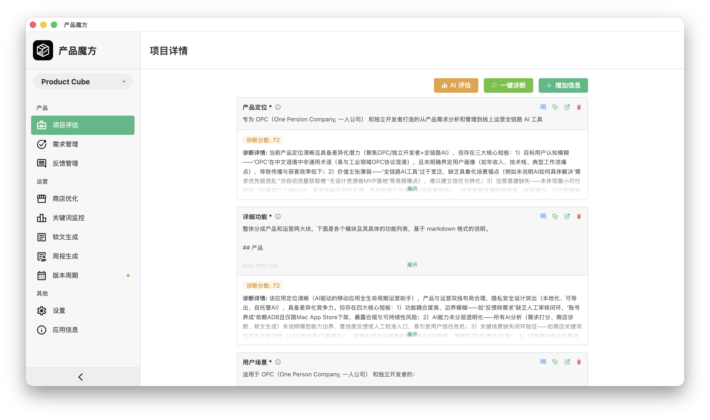
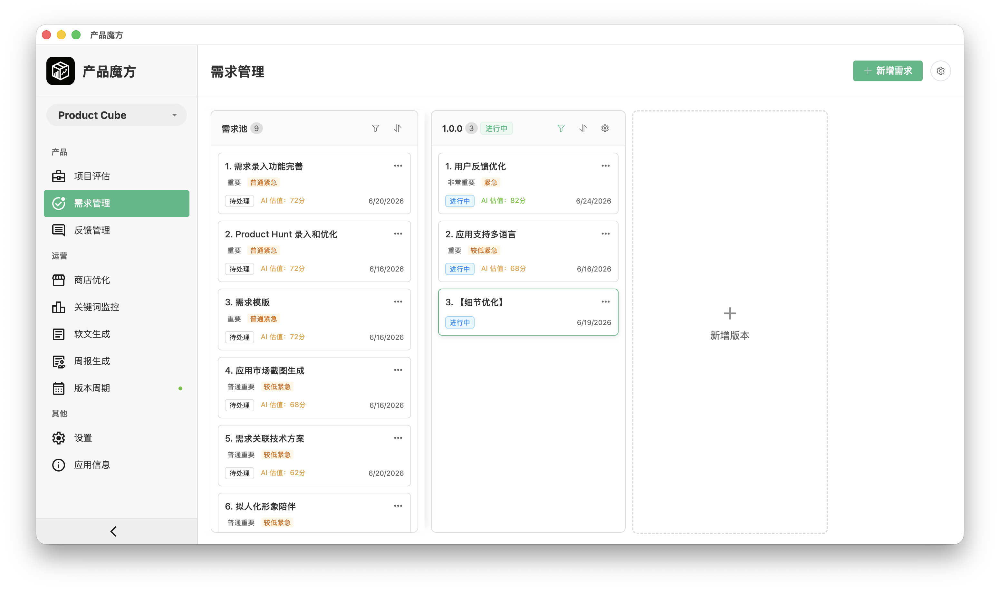
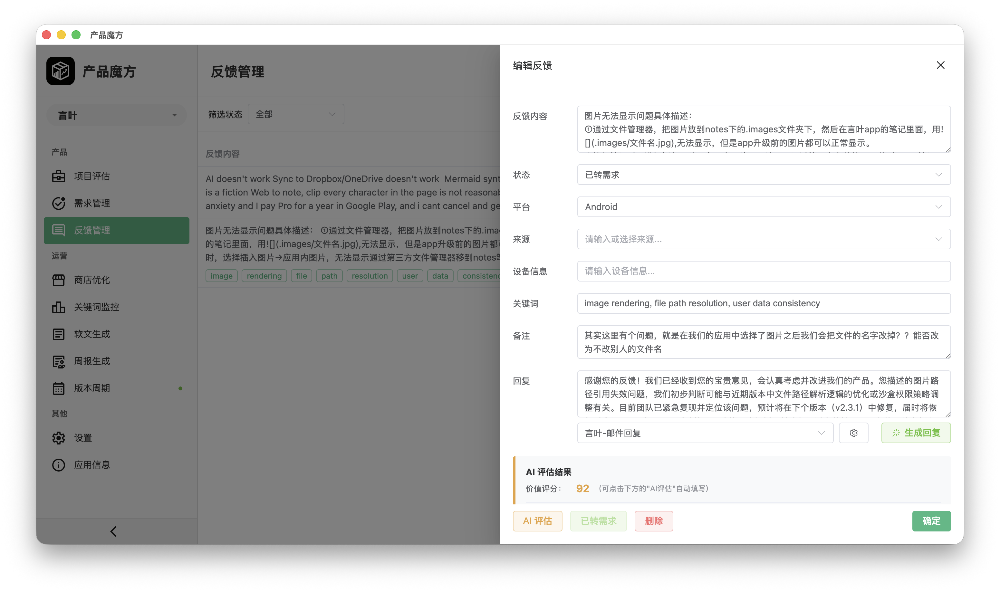
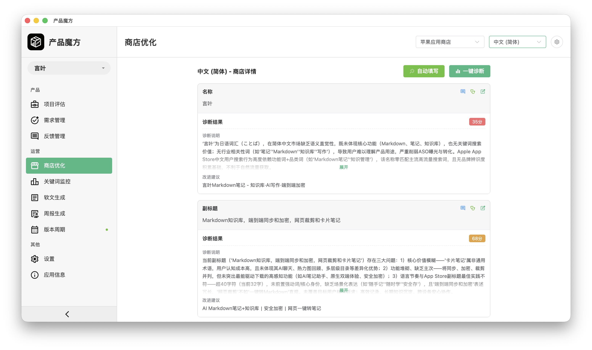
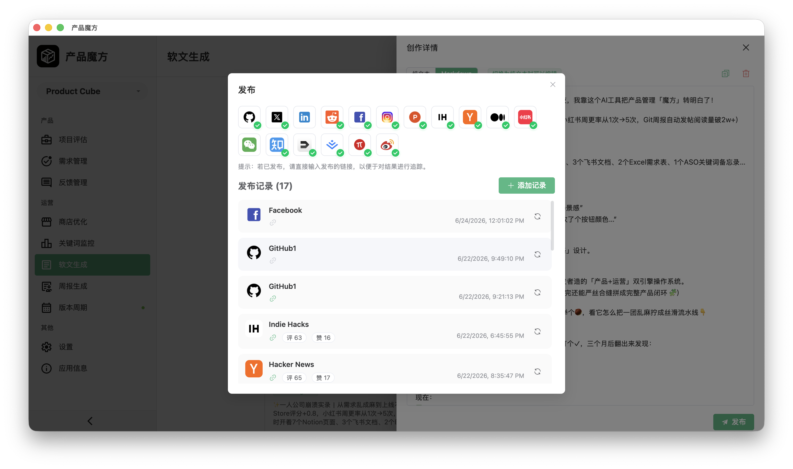
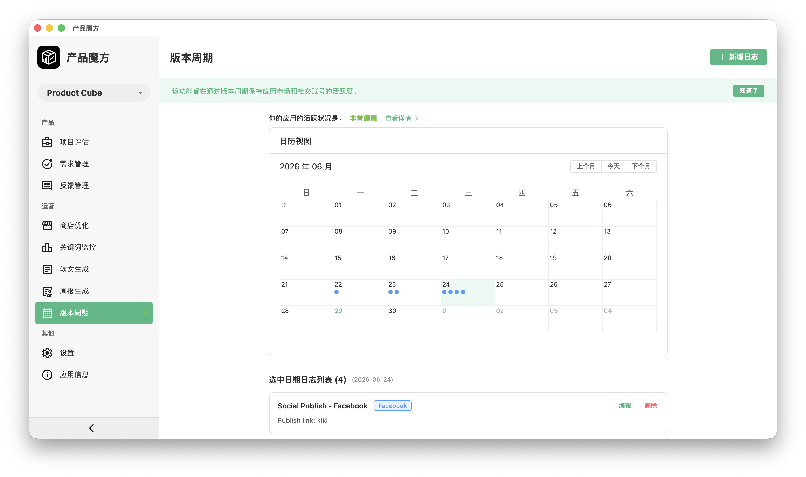

# 🧊 产品魔方

**专为单人创业团队与独立开发者打造的全能AI辅助工具**

✅ 功能完整成型

✅ 可直接投入商用

✅ 无测试版阶段，所有功能正式上线

由独立开发者打造、服务个人创业者：集创意诊断、需求驱动开发、应用商店优化增长于一体，是一款主打隐私安全的桌面端全能工具。

**本地优先存储，你的数据绝不外泄**

## 🌟 为什么选择 Product Cube？

单人开发创业道阻且长。兼顾产品思路梳理、用户反馈整理、应用商店搜索引擎优化、社交内容运营、版本发布统筹，会消耗大量精力，扼杀创作灵感。

**Product Cube 彻底解决多场景频繁切换的效率损耗**。它并非普通的AI对话机器人，也不是功能零散的SaaS工具，而是一套高度集成、支持离线使用的桌面工作空间。**产品战略规划、需求验证、增长运营工作可一站式完成**。你可自主接入本地或自建AI大模型，全程无后台数据追踪、无云端绑定锁定。

完美适配单人创业团队的核心需求：

🔹 完全自主掌控技术架构与数据堆栈

🔹 高效迭代发布，拒绝盲目开发

🔹 真实自然稳步增长，拒绝算法流量堆砌

## ✅ 核心功能（全部正式上线）

### 🧩 产品工作流

助力模糊创意落地为有序待办清单，所有规划均基于真实用户需求，有据可依。

#### 项目分析

- 自动诊断产品定位、核心功能、适用场景及商业模式可行性

- 生成全方位项目健康度评分，并提供可落地的优化建议

- 智能语境对话：可提问“如何优化产品变现模式？”“相较于竞品，产品存在哪些短板？”等问题获取专业解答

#### 需求驱动型需求管理

- 支持功能、核心模块、用户故事的新增、查询、修改、删除全流程管理

- 版本全程追踪，AI自动生成更新日志与版本说明，适配Git版本管理

- AI智能需求评分：结合紧急程度、影响范围、开发成本综合评估，并生成通俗易懂的评分依据

#### 反馈智能分析

- 统一收集、筛选处理邮件、应用内、社交平台的各类用户反馈

- 结合产品自身定位，AI辅助分析用户反馈情感倾向与落地可行性

- 一键将用户反馈转化为优先级明确的开发需求

- 自带模板化回复功能，可自适应语气生成官方回复（例如：“我们已收到你的建议，目前该功能暂不推进，具体原因如下”）

### 🚀 运营工作流

无需组建营销团队，让每一次版本发布都成为产品增长的契机。

#### 应用商店优化（ASO）工具箱

- 支持手动导入或网页抓取谷歌应用商店、苹果应用商店的产品上架信息

- 一键ASO合规检测：涵盖关键词密度、标题/描述评分、图标与截图优化指导

- AI智能推荐优化关键词，支持排名监控（可开启轻量API代理功能）

- 智能编辑商店展示内容：可指令“优化副标题，提升产品点击率”等针对性修改

#### 社交专属内容生成引擎

- 一键生成适配推特、领英、Mastodon、Bluesky等平台的软发布文案，自动适配各平台风格

- 内置互动数据追踪体系：统计链接点击、评论、转发数据，反向优化用户反馈与产品迭代规划

- 所有内容贴合产品实时动态，关联最新版本更新、用户评价与Git提交记录

#### 公开开发周报自动生成

- 关联Git代码仓库，自动解析代码提交、合并请求、问题工单记录

- 生成风格自然、内容详实的周报，适配邮件推送与社交平台发布

- 支持命令行自动定时发布，或导出为Markdown、HTML格式文件

#### 版本与运营健康度看板

- 统一监控应用商店、网页端、社交平台的所有版本发布时间

- 自动检测运营空窗期（例如：距离上次内容发布已37天）

- 可视化运营健康评分，综合考量内容更新频率、曝光量、用户共鸣度

⚠️ 备注：小红书账号运营自动化功能为内部能力，未对公开版开放，官方文档与操作界面均不展示该功能。

### 🔒 隐私与自主掌控（核心保障）

- **自主接入AI，规则全权自定义**：可接入Ollama、LM Studio等本地大模型，或本地vLLM、文本生成网页端接口

- **零云端同步**：所有数据本地存储（SQLite数据库\+加密JSON文件），支持随时导出，无平台绑定限制

- **离线优先使用**：离线状态下也可完成反馈分析、日志生成、文案撰写等全部核心操作

- **全程无追踪**：无数据分析、无后台监控、无用户数据采集，绝对保障隐私

## 🛠️ 快速上手

- 下载对应系统最新版本（支持macOS、Windows）

- 配置个人常用AI大模型接口

- 导入现有项目或新建空白项目，即可开启产品诊断、需求排序、内容发布全流程工作

📖 完整文档、命令行参考与工作流教程：[官方文档](https://meiyan.tech/app/help?app=cube)

💬 加入独立开发者交流社区：[Discord社群](https://discord.gg/Y4YQnMfa)

💡 Product Cube 并非为了取代开发者，而是替代繁杂的多工具、多表格、多页面切换工作。

**专注开发创作，繁琐统筹工作交给工具**

—— 为默默深耕、稳步迭代增长的单人创业者量身打造

> （注：部分内容可能由 AI 生成）
